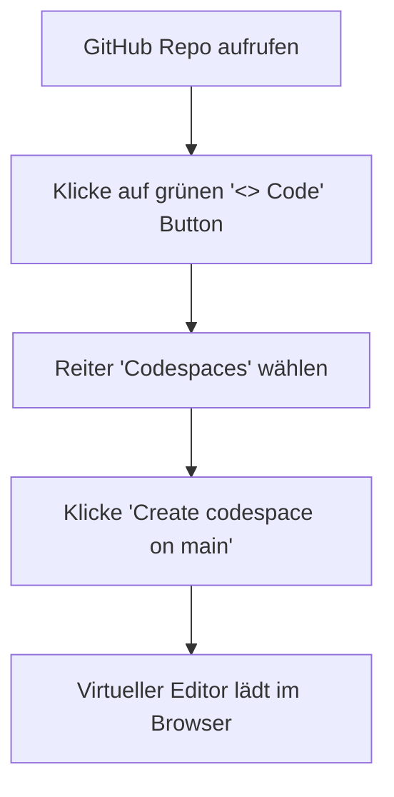

# 📌 Projektdokumentation: Gleichungslöser & GitHub-Integration

Diese Dokumentation fasst die Erkenntnisse, Korrekturen und die GitHub-Cloud-Konfiguration für das Projekt **quadratic_equation** zusammen.

---

## 📖 1. Projektübersicht
Das Projekt löst mathematische Gleichungen der Form:
$$ax^2 + bx + c = 0$$
Es wurde von einem reinen Löser für quadratische Gleichungen zu einem robusten, universellen Löser erweitert, der auch lineare Sonderfälle abfängt, ohne abzustürzen.

---

## 🛠️ 2. Wichtige Erkenntnisse & Codekorrekturen

### Das Problem (Ausgangslage)
Im ursprünglichen Code führte ein Wert von $a = 0$ zu einer Division durch Null (`ZeroDivisionError`), da die quadratische Lösungsformel durch $2a$ teilt.

### Die Lösung (Erweiterte Logik)
Wenn $a = 0$ ist, handelt es sich nicht mehr um eine quadratische, sondern um eine **lineare Gleichung** ($bx + c = 0$). Wir haben die mathematischen Sonderfälle wie folgt implementiert:

| Fall | Mathematische Bedingung | Ergebnis / Rückgabe | Logischer Hintergrund |
| :--- | :--- | :--- | :--- |
| **Lineare Gleichung** | $a = 0, b \neq 0$ | $x = -\frac{c}{b}$ (1 Lösung) | Die Gleichung lässt sich eindeutig nach $x$ auflösen. |
| **Widerspruch (Keine Lösung)** | $a = 0, b = 0, c \neq 0$ | `"Keine Lösung"` | Die Gleichung führt zu einem Widerspruch (z. B. $5 = 0$). |
| **Identität (Unendlich viele)** | $a = 0, b = 0, c = 0$ | `"Unendlich viele Lösungen"` | Jede Zahl für $x$ löst die Gleichung ($0 = 0$). |

---

## 🧪 3. Qualitätssicherung (Unit-Tests)
Zur Absicherung aller mathematischen Pfade wurde die Testdatei `test_solver.py` hinzugefügt. Sie umfasst **6 automatisierte Testfälle**:
1. Quadratische Gleichung mit zwei reellen Lösungen.
2. Quadratische Gleichung mit einer reellen Doppellösung.
3. Quadratische Gleichung mit komplexen Lösungen.
4. Lineare Gleichung ($a = 0$) mit einer Lösung.
5. Linearer Sonderfall mit *Keiner Lösung*.
6. Linearer Sonderfall mit *Unendlich vielen Lösungen*.

---

## 🚀 4. GitHub-Zugang & Cloud-Ausführung
Das Projekt wurde erfolgreich auf GitHub versioniert und lässt sich ohne lokale Installation direkt im Browser ausführen.

### 🔗 Repository-Details
* **GitHub Link:** [twinklerpriv-star/quadratic_equation](https://github.com/twinklerpriv-star/quadratic_equation)
* **Hauptzweig:** `main`

### 🖥️ Anleitung: Ausführen in GitHub Codespaces
Mit GitHub Codespaces lässt sich das Skript ohne jegliche lokale Einrichtung in einer virtuellen Cloud-Maschine starten:



#### Schritt-für-Schritt im geladenen Codespace:
1. **Erweiterungen:** Nach dem Laden des Codespaces empfiehlt VS Code die Installation der **Python-Erweiterung von Microsoft**. Klicke auf **Installieren**, um Features wie Autovervollständigung zu aktivieren.
2. **Terminal aktivieren:** Klicke unten in den Reiter **TERMINAL**.
3. **Ausführen des Lösers:**
   ```bash
   python quadratic_solver.py
   ```
4. **Ausführen der Tests:**
   ```bash
   python test_solver.py
   ```

---

## 🔒 5. Sicherheit & Git-Authentifizierung
Beim Push-Vorgang auf GitHub wurde der **Git Credential Manager** verwendet.
* Dieser sichere Dienst ermöglicht die tokenbasierte Anmeldung via Webbrowser durch einmaliges Klicken auf **„git-Ökosystem autorisieren“**.
* Passwörter oder private Schlüssel müssen dadurch nicht unverschlüsselt auf dem lokalen PC hinterlegt werden.
